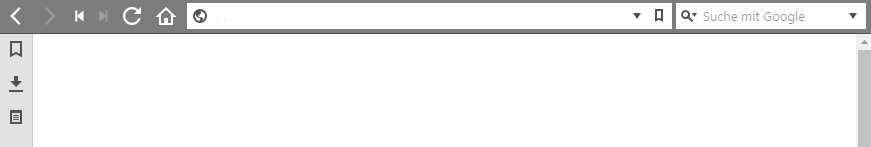

# react-nanobar

[![npm version][version-image]][version-url]
[![dependency status][david-image]][david-url]
[![license][license-image]][license-url]
[![js standard style][standard-image]][standard-url]
[![downloads per month][downloads-image]][downloads-url]

> [​Nanobar](http://nanobar.jacoborus.codes) wrapped up as a React component.



## Installation

```bash
> npm install react-nanobar
```

## Usage

```js
import Nanobar from 'react-nanobar'

export default function MyProgress () {
  return (
    <Nanobar progress={60} />
  )
}
```

## License

[MIT][license-url]

[version-image]: https://img.shields.io/npm/v/react-nanobar.svg?style=flat-square
[version-url]: https://npmjs.org/package/react-nanobar

[downloads-image]: https://img.shields.io/npm/dm/react-nanobar.svg?style=flat-square
[downloads-url]: https://npmjs.org/package/react-nanobar

[david-image]: http://img.shields.io/david/queckezz/react-nanobar.svg?style=flat-square
[david-url]: https://david-dm.org/queckezz/react-nanobar

[standard-image]: https://img.shields.io/badge/code-standard-brightgreen.svg?style=flat-square
[standard-url]: https://github.com/feross/standard

[license-image]: http://img.shields.io/npm/l/react-nanobar.svg?style=flat-square
[license-url]: ./license
